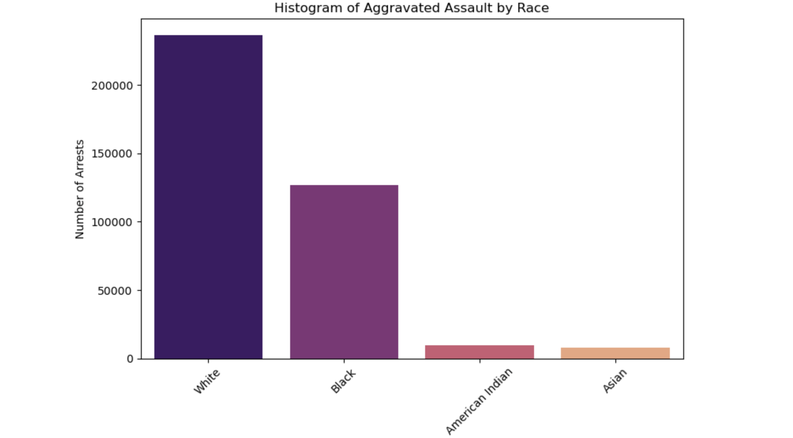
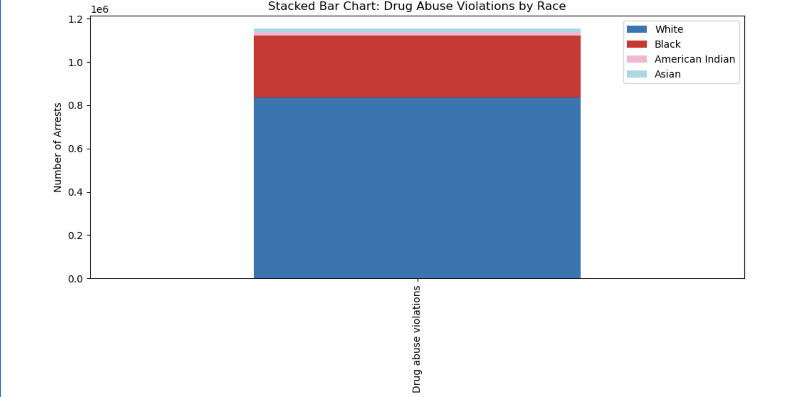
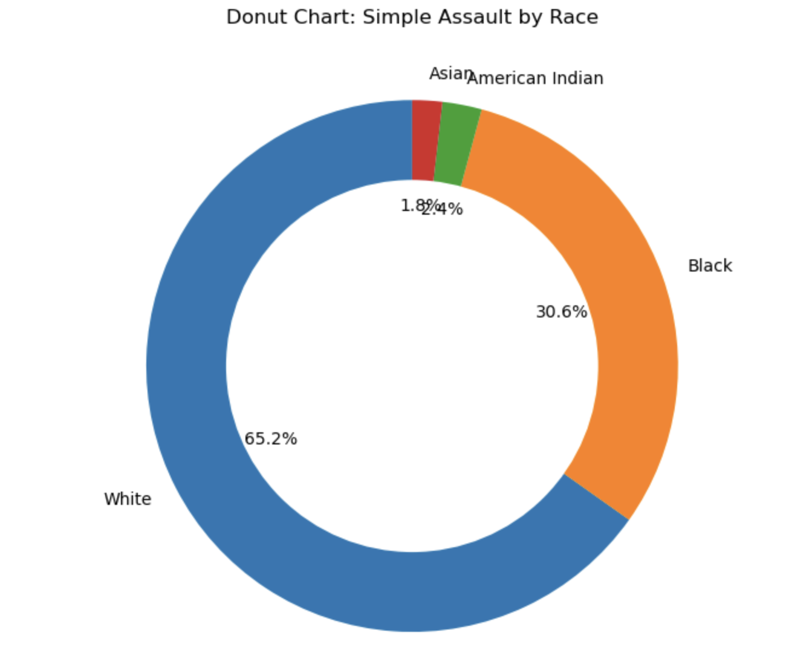
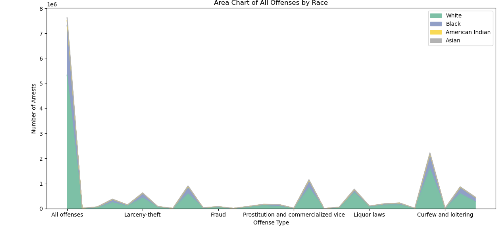
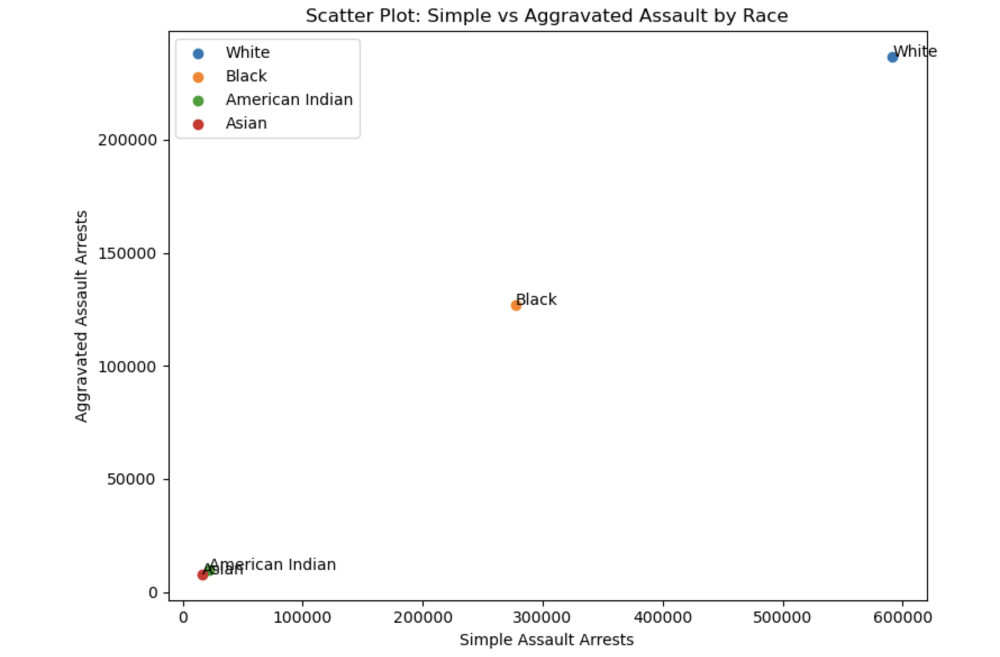
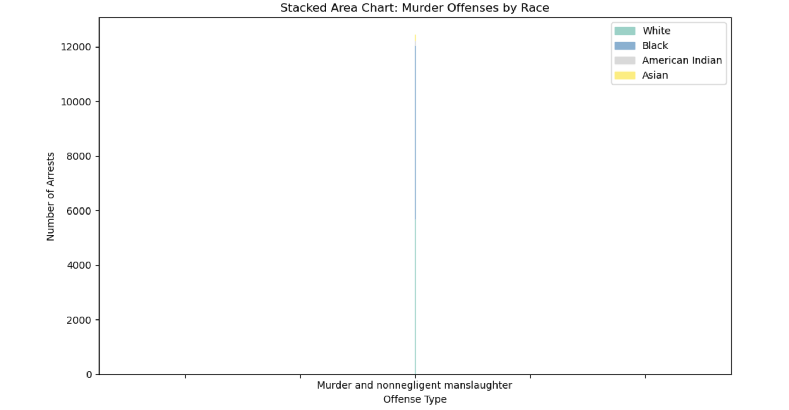

# ArrestDisparitiesAnalysis: Racial Disparities in U.S. Arrest Data

## Project Overview

ArrestDisparitiesAnalysis is a data analytics project focused on examining racial disparities within U.S. arrest records. Using exploratory data analysis (EDA) and statistical visualization techniques, this project investigates arrest patterns across multiple offense categories and demographic groups.

The objective of the project is to identify trends, evaluate proportional representation across offense types, and demonstrate how data analytics can be applied to public policy and criminal justice datasets.

---

## Business Problem

Government agencies, researchers, and policymakers rely on accurate crime and arrest data to make informed decisions regarding public safety, resource allocation, and policy development.

Understanding disparities within arrest records is important for:

* Criminal justice research
* Policy evaluation
* Resource allocation
* Trend identification
* Public sector analytics
* Data-driven decision making

This project demonstrates how analytical techniques can transform raw arrest data into meaningful insights.

---

## Project Objectives

* Analyze arrest patterns across racial groups.
* Examine offense-specific arrest distributions.
* Identify trends across multiple crime categories.
* Compare arrest frequencies between demographic groups.
* Visualize relationships among offense classifications.
* Demonstrate practical applications of exploratory data analysis.

---

## Dataset

The dataset contains arrest information categorized by:

* Race
* Offense Type
* Arrest Counts
* Crime Classification

Offense categories analyzed include:

* Aggravated Assault
* Simple Assault
* Drug Abuse Violations
* Murder
* Additional offense categories

The dataset was cleaned and structured to support visualization and exploratory analysis.

---

## Methodology

### Data Preparation

* Data cleaning
* Validation of arrest counts
* Standardization of demographic categories
* Formatting for visualization

### Exploratory Data Analysis (EDA)

The analysis focused on:

* Distribution analysis
* Comparative analysis
* Trend evaluation
* Demographic segmentation

### Statistical Visualization

Multiple visualizations were developed to reveal:

* Arrest frequency distributions
* Offense-specific disparities
* Comparative demographic trends
* Multi-category offense behavior

---

## Thought Process

The primary objective was to determine whether arrest data could reveal meaningful demographic patterns across offense categories.

Questions explored included:

* Which offense categories account for the highest arrest volume?
* How do arrest patterns differ across racial groups?
* Are disparities consistent across offense types?
* Which offenses demonstrate the greatest variation between groups?
* What trends become visible when visualized graphically?

By transforming raw data into visual analytics, patterns become significantly easier to interpret and communicate.

---

# Visualizations

## Project Thumbnail


Primary project visualization used throughout the portfolio and repository branding.

---

## Histogram of Aggravated Assault by Race



This visualization displays the distribution of aggravated assault arrests across racial groups and highlights differences in arrest frequency.

---

## Drug Abuse Violations by Race



A stacked bar chart illustrating how drug abuse violation arrests are distributed across demographic groups.

---

## Simple Assault by Race



A donut chart comparing simple assault arrest distributions among racial categories.

---

## All Offenses by Race



Area chart showing overall arrest volume patterns across multiple offense categories and demographic groups.

---

## Simple vs Aggravated Assault Comparison



Scatter plot comparing simple assault and aggravated assault arrest counts across racial groups.

---

## Murder Offenses by Race



Stacked area chart illustrating murder offense arrest distributions across demographic categories.

---

## Key Findings

The analysis revealed several notable patterns:

* Arrest distributions vary significantly across offense categories.
* Certain offenses account for a disproportionate share of total arrests.
* Visual analysis highlights demographic differences across offense classifications.
* Comparative analysis provides insight into offense-specific trends.
* Data visualization significantly improves interpretability of large arrest datasets.

---

## Business Impact

This project demonstrates how analytics can support:

* Public policy research
* Criminal justice analysis
* Government reporting
* Data-driven decision making
* Trend identification
* Resource planning

The methodology can be applied to broader public-sector datasets and social science research initiatives.

---

## Skills Demonstrated

### Data Science

* Exploratory Data Analysis (EDA)
* Statistical Analysis
* Data Cleaning
* Trend Identification

### Data Visualization

* Histograms
* Stacked Bar Charts
* Donut Charts
* Scatter Plots
* Area Charts

### Python Analytics

* Pandas
* NumPy
* Matplotlib
* Seaborn

### Public Sector Analytics

* Demographic Analysis
* Comparative Analysis
* Policy-Oriented Analytics
* Criminal Justice Data Exploration

---

## Technologies Used

* Python
* Pandas
* NumPy
* Matplotlib
* Seaborn
* Jupyter Notebook

---

## Repository Structure

```text
ArrestDisparitiesAnalysis/
│
├── notebook/
│   └── ArrestDisparitiesAnalysis.ipynb
│
├── visuals/
│   ├── ArrestDisparitiesAnalyticsAI.png
│   ├── histogram_aggravated_assault_by_race.png
│   ├── drug_abuse_violations_by_race.png
│   ├── simple_assault_by_race_donut.png
│   ├── all_offenses_by_race_area_chart.png
│   ├── simple_vs_aggravated_assault_scatter.png
│   └── murder_offenses_by_race_stacked_area.png
│
├── data/
├── docs/
├── README.md
├── requirements.txt
└── .gitignore
```

---

## Installation

Clone the repository:

```bash
git clone https://github.com/Dare215/ArrestDisparitiesAnalysis.git
```

Navigate into the project:

```bash
cd ArrestDisparitiesAnalysis
```

Install dependencies:

```bash
pip install -r requirements.txt
```

Launch Jupyter Notebook:

```bash
jupyter notebook
```

Open:

```text
notebook/ArrestDisparitiesAnalysis.ipynb
```

---

## Future Improvements

Potential enhancements include:

* Predictive crime modeling
* Geographic analysis
* Interactive dashboards
* Time-series trend analysis
* Machine learning classification
* Public policy forecasting

---

# Author

**Darious Brown**
PhD Candidate – Artificial Intelligence & Machine Learning Specialization
DBA Candidate
Data Scientist | Machine Learning Engineer | AI Researcher

### Professional Profiles

GitHub: https://github.com/Dare215

LinkedIn: https://www.linkedin.com/in/dariousbrown

Portfolio: https://dare215.github.io/DariousBrown-Portfolio/

Email: [dariousbrown3@icloud.com](mailto:dariousbrown3@icloud.com)

---

## Areas of Expertise

* Artificial Intelligence
* Machine Learning
* Deep Learning
* Generative AI
* Natural Language Processing
* Computer Vision
* Predictive Analytics
* Data Science
* Financial Analytics
* Healthcare Analytics
* Manufacturing Analytics

---

## About This Portfolio

This repository is part of a larger Artificial Intelligence and Data Science portfolio showcasing machine learning, deep learning, predictive analytics, natural language processing, generative AI, computer vision, forecasting, optimization, and business intelligence projects developed throughout graduate and doctoral studies.

---

# License

This project is intended for educational, research, and portfolio demonstration purposes.
